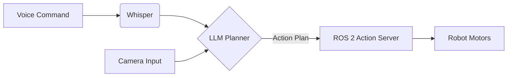

# Module 4: Vision-Language-Action (VLA)

## The Final Frontier: Conversational Robotics

A **Vision-Language-Action (VLA)** model connects natural language (what we say) and vision (what the robot sees) directly to robotic actions (what the robot does).

### Voice-to-Action Pipeline

1.  **Hear**: Use **OpenAI Whisper** to transcribe voice commands ("Go pick up the red ball").
2.  **Think**: An LLM (like GPT-4o or Gemini 1.5 Pro) plans the task.
    - *Input*: "Pick up red ball" + [List of visible objects]
    - *Output*: `[{"action": "navigate", "target": "red_ball"}, {"action": "grasp"}]`
3.  **Act**: The robot executes the primitive actions.

### LLM-Based Cognitive Planning

We treat the LLM as the "Prefrontal Cortex" of the robot. It handles high-level reasoning, while ROS 2 handles the muscle memory.

## Capstone: Autonomous Humanoid

**Goal**: Build a robot that can:
1.  Navigate a room.
2.  Find a specific object requested by voice.
3.  Approach it safely.

*(This corresponds to the final assessment of the course)*
