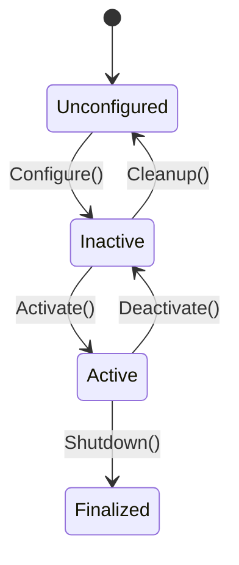

# ROS 2 Nodes, Topics, and the DDS Middleware

## 1. The Robotic Nervous System: A Deep Dive

In the realm of Physical AI, the **Robot Operating System 2 (ROS 2)** is not just a library; it is the fundamental middleware that allows a machine to "think" and "act" in parallel. Unlike its predecessor, ROS 1, which relied on a custom TCP/IP master, ROS 2 is built on top of the **Data Distribution Service (DDS)** standard.

### 1.1 Why DDS Matters for Humanoids

Humanoid robots require real-time control. If your robot is balancing on one leg, a delay of 10 milliseconds in the motor command loop can cause it to fall. DDS provides:

-   **Real-time guarantees**: Ensuring messages arrive within a deadline.
-   **Quality of Service (QoS)**: Fine-tuning how data is sent (e.g., "Best Effort" for video, "Reliable" for motor commands).
-   **Decentralization**: No single point of failure (no "roscore").

```mermaid
graph TD
    A[Camera Node] -->|Topic: /image_raw (Best Effort)| B(Vision Processing Node);
    B -->|Topic: /obstacle_pos (Reliable)| C{Navigation Node};
    C -->|Topic: /cmd_vel (Reliable)| D[Motor Controller Node];
    subgraph "DDS Domain (ID: 0)"
    A
    B
    C
    D
    end
```

### 1.2 Executors and Threading

In standard Python, code runs line-by-line. In robotics, 50 things happen at once.
ROS 2 uses **Executors** to manage callbacks.

-   **SingleThreadedExecutor** (Default): Safest. Processes one callback at a time.
-   **MultiThreadedExecutor**: Dangerous but fast. Runs multiple callbacks in parallel threads.

**Warning: Deadlocks**
If `Callback A` waits for `Callback B`, but `Callback B` is stuck waiting for the same Executor thread as `A`, your robot freezes. This is a **Deadlock**.

---

## 2. Nodes: The Atoms of Computation

A **Node** is a single, modular process. In a humanoid, you might have hundreds of nodes running simultaneously:

-   `face_recognition_node`
-   `balance_controller_node`
-   `speech_synthesis_node`
-   `battery_monitor_node`

### 2.1 Lifecycle Nodes (Managed Nodes)

For professional robotics, we use **Lifecycle Nodes**. These nodes have managed states (`Unconfigured`, `Inactive`, `Active`, `Finalized`). This prevents a robot from trying to walk before its sensors are calibrated.

#### State Machine of a Lifecycle Node



---

## 3. Topics: Asynchronous Communication

Topics are the "blood vessels" carrying data. They use a Publish/Subscribe model.

### 3.1 Topic Statistics & Bandwidth

When running high-bandwidth sensors (like a RealSense D435i depth camera), topics can saturate your network.

**Command to check bandwidth:**
```bash
ros2 topic bw /camera/depth/image_rect_raw
```

**Output Example:**
```text
Subscribers: 1
Publisher count: 1
Average: 24.5 MB/s
Mean: 24.1 MB/s
Min: 22.0 MB/s
Max: 26.5 MB/s
```

If you see >500 MB/s, you might need to use **Zero Copy** transport (shared memory) to prevent CPU overload on the Jetson Orin.

### 3.2 QoS Profiles: History and Reliability

-   **History: KEEP_LAST (Depth: 10)**: "Only remember the last 10 messages. If the consumer is slow, drop old ones." (Good for sensors).
-   **History: KEEP_ALL**: "Never drop a message." (Good for logs).
-   **Reliability: BEST_EFFORT**: "Fire and forget." (UDP-like).
-   **Reliability: RELIABLE**: "Retry until ack." (TCP-like).

---

## 4. Hands-On: A Complex Python Node

Let's write a node that simulates a **Temperature Monitor** for the robot's joints. It will publish an alarm if the temperature exceeds a threshold.

### `joint_monitor.py`

```python
import rclpy
from rclpy.node import Node
from std_msgs.msg import Float32, String
import random

class JointTemperatureMonitor(Node):
    def __init__(self):
        super().__init__('joint_temp_monitor')
        
        # Publisher for Alarms (Reliable QoS)
        self.alarm_pub = self.create_publisher(String, '/robot/status/alarm', 10)
        
        # Publisher for Telemetry (Best Effort QoS)
        self.temp_pub = self.create_publisher(Float32, '/robot/joint/knee_temp', 10)
        
        # Timer: Run at 10 Hz (every 0.1 seconds)
        self.timer = self.create_timer(0.1, self.check_temperature)
        
        self.get_logger().info("Joint Monitor Started...")

    def check_temperature(self):
        # Simulate sensor reading (20C to 90C)
        current_temp = random.uniform(20.0, 90.0)
        
        # Publish Telemetry
        msg = Float32()
        msg.data = current_temp
        self.temp_pub.publish(msg)
        
        # Check logic
        if current_temp > 80.0:
            alarm = String()
            alarm.data = f"CRITICAL: Knee Joint Overheat! ({current_temp:.2f}C)"
            self.alarm_pub.publish(alarm)
            self.get_logger().warn(alarm.data)

def main(args=None):
    rclpy.init(args=args)
    node = JointTemperatureMonitor()
    try:
        rclpy.spin(node)
    except KeyboardInterrupt:
        pass
    finally:
        node.destroy_node()
        rclpy.shutdown()

if __name__ == '__main__':
    main()
```

### 4.1 Running the Node

1.  Save the file as `joint_monitor.py`.
2.  Run it: `python3 joint_monitor.py`
3.  In another terminal, listen to the alarm: `ros2 topic echo /robot/status/alarm`

You will see alarms appearing only when the random temperature exceeds 80°C.
