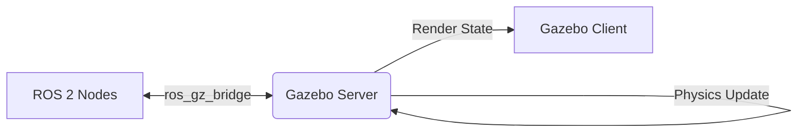

# Module 2: The Digital Twin & Simulation Theory

## 1. Why We Simulate: The Reality Gap

In Physical AI, the **Reality Gap** is the discrepancy between how a robot behaves in a simulator versus the real world. If you train a robot to walk on a perfectly flat friction=1.0 surface in a simulation, it will likely fall immediately on real carpet.

### 1.1 The Digital Twin

A **Digital Twin** is not just a 3D model; it is a physics-accurate replica that accounts for:
-   **Inertia**: The resistance of the robot's limbs to movement.
-   **Friction**: Kinetic and static friction coefficients of feet.
-   **Actuator Dynamics**: Real motors don't reach target speed instantly; they have torque curves and delays.

---

## 2. Numerical Integration: The Heart of Physics

Physics engines solve differential equations $F=ma$ over discrete time steps.

### 2.1 Euler Method (Fast, Unstable)
```
v(t+1) = v(t) + a(t) * dt
x(t+1) = x(t) + v(t) * dt
```

If dt is too large (e.g., 100ms), errors accumulate, and the robot might explode into space.

### 2.2 Runge-Kutta 4 (RK4) (Slow, Accurate)
Takes 4 samples of the slope during the time step to calculate the average change. Used for high-precision simulations (e.g., NASA robotics).

### 2.3 Semi-Implicit Euler (Symplectic)
The gold standard for robotics (used in Isaac Gym). It conserves energy better than standard Euler, preventing the "vibrating robot" syndrome.

---

## 3. Physics Engines: ODE vs Bullet vs PhysX

Gazebo (and Ignition/Gazebo Sim) allows you to choose your underlying physics engine.

| Engine | Pros | Cons | Best For |
| :--- | :--- | :--- | :--- |
| **ODE (Open Dynamics Engine)** | Stable, default in ROS | Less accurate for complex contacts | Wheeled robots, simple arms |
| **Bullet** | Better collision detection | Slower than ODE | Games, object manipulation |
| **NVIDIA PhysX** | GPU-accelerated, massive scale | Proprietary (until recently), requires NVIDIA GPU | **Humanoid RL Training** (Isaac Gym) |

### 3.1 The Time Step

Simulations run in discrete time steps (e.g., 1ms).
-   **Real-time Factor**: If ratio < 1.0, the sim is running slower than real life.
-   **Hardware-in-the-Loop (HIL)**: Connecting the real robot's computer (Jetson) to the simulation PC to test the actual code performance.

---

## 4. Gazebo Architecture

Gazebo is split into two main processes:

1.  **gz-server**: Runs the physics loop and sensor generation. It has no GUI. You can run this on a headless cloud server (AWS).
2.  **gz-client**: The visualization GUI. Connects to the server to render the scene.



---

## 5. Hands-On: Launching an Empty World

To start a basic simulation environment:

```bash
sudo apt install ros-humble-ros-gz
ros2 launch ros_gz_sim gz_sim.launch.py gz_args:="empty.sdf"
```

This launches the new **Gazebo Harmonic** (formerly Ignition), which is the standard for ROS 2.
